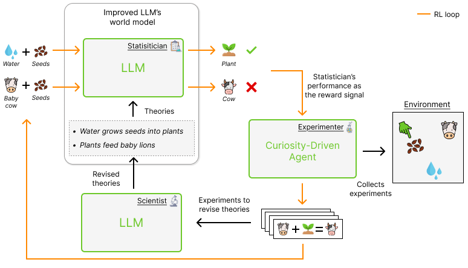

# WorldLLM
We introduce WorldLLM, a framework for autonomous improvement of an LLM's world modeling abilities. Our approach combines 1) probabilistic theory induction to produce hypotheses that are given in our LLM's prompt to improve its predictions and 2) curiosity-driven RL to explore the environment and collect transitions poorly predicted with the current hypotheses.

## Method
   
Our framework aims at improving an LLM's ability to predict the outcome of state-action pairs by augmenting it with natural language hypotheses about the world (Statistician). 
WorldLLM alternates between generating hypotheses (Scientist) and collecting evidence to update these hypotheses (Experimenter). The former uses Bayesian inference with an LLM as the proposal distribution. 
The latter uses curiosity-driven RL to train an agent to collect experiences that have a low likelihood under the Statistician with the current set of hypotheses.

More details are accessible in our [paper]().

## Project Structure

The repository is organized as follows:

```
WorldLLM/
│
├── configs/
│   ├── algorithm/
│   ├── environment/
│   ├── experimenter/
│   ├── llm/
│   ├── base_config.yaml
│   └── ...
│
├── lab/
│
├── montecarlo_methods/
│   ├── importance_sampling.py
│   └── metropolis_hastings.py
│
├── plots/
│
├── utils/
│
├── worldllm_envs/
│   ├── door/
│   └── playground/
│
├── main.py
├── .gitignore
├── README.md
└── LICENSE
```

- `configs/`: YAML file to configure main.py using `hydra`.
- `lab/`: Folder containing single files to evaluate the generated world model or to test scoring methods.
- `montecarlo_methods/`: Implementation of Monte Carlo methods.
- `plots/`: Jupyter notebooks used to analyze our results.
- `utils/`: Utility functions and scripts for LLMs and agents.
- `worldllm_envs/`: Custom environments for the WorldLLM project.
- `main.py`: Main script to run the project.

# Getting Started
This project was developed on PyTorch using Hugging Face's Transformers library.
## Setup

The project was run with Python 3.10.12 and managed in a virtual environment with pip. To run this repository, ensure you have all the required dependencies installed by running:

```sh
pip install -r requirements.txt
```
You also need to install worldllm_envs as a module:
```sh
pip install -e worldllm_envs
```
## Run

The configuration of the script is managed with `hydra`. To obtain the intended behavior, create a YAML file based on the examples in `./configs/`. To launch the program, execute the following command:

```sh
python main.py -cn config_name
```
For example
```sh
python main.py -cn play_metropolis_pb.yaml
```
## Configs
Each config looks similar to this:
```yaml
defaults:
  - base_config                                 # Contain base config(like seed, exp_name)
  - algorithm: metropolis_hastings              # Monte Carlo Method to use
  - llm@theorist: Phi-3-mini-4k-instruct        # Theorist LLM
  - llm@statistician: Phi-3-mini-4k-instruct    # Statistician LLM
  - experimenter: sb3agent                      # Experimenter model to use(oracle or RL agent)
  - environment: playground_rl                  # Environment to use

exp_name: test_pipeline                         # Override defaut exp name

statistician: null                              # Override to null to use the same LLM as the Theorist
seed: 60                                        # Seed to use
algorithm:                                      # Override the algorithm base config 
  nb_phases: 400
  nb_iterations: 5
```

# FAQ
If you have any questions, open an issue. I will try to answer them the best I can.