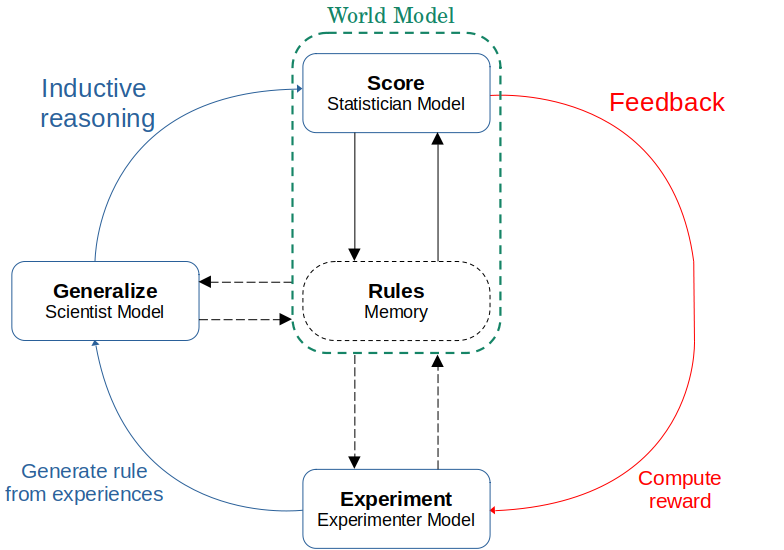

# WorldLLM

Let some place for citation later 
## Method
Explanation of the problem and the solution the algorithm proposes(Based on the report)



## Project Structure

The repository is organized as follows:

```
WorldLLM/
│
├── configs/
│   ├── algorithm/
│   ├── environment/
│   ├── experimenter/
│   ├── llm/
│   ├── base_config.yaml
│   └── ...
│
├── lab/
│
├── montecarlo_methods/
│   ├── importance_sampling.py
│   └── metropolis_hastings.py
│
├── utils/
│
├── worldllm_envs/
│   ├── door/
│   └── playground/
│
├── main.py
├── .gitignore
├── README.md
└── LICENSE
```

- `configs/`: YAML file to configure main.py using `hydra`
- `lab/`: Folder containing single files to evaluate the generated worldmodel or to test scoring methods
- `montecarlo_methods/`: Implementation of Monte Carlo methods.
- `utils/`: Utility functions and scripts for LLMs and agents
- `worldllm_envs/`: Custom environments for the WorldLLM project.
- `main.py`: Main script to run the project.

## Setup

The project was run with Python 3.10.12 and managed in a virtual environment with pip. To run this repository, ensure you have all the required dependencies installed by running:

```sh
pip install -r requirements.txt
```

## Run

The configuration of the script is managed with `hydra`. To obtain the intended behavior, create a YAML file based on the examples in `./configs/`. To launch the program, execute the following command:

```sh
python main.py -cn play_metropolis_pb.yaml
```